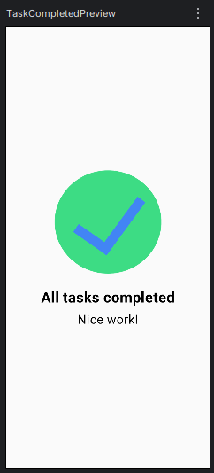

# ✅ Administrador de Tareas

Una interfaz Android que muestra una pantalla de confirmación de tarea completada exitosamente.

## 📸 Vista previa

<p align="center">
  
</p>

## 🛠️ Tecnologías utilizadas

- **Lenguaje**: Kotlin
- **Interfaz**: Jetpack Compose
- **Herramientas**: Android Studio
- **Gestión de dependencias**: Gradle

## 🚀 Cómo clonar y ejecutar el proyecto

1. **Clona el repositorio**:
```bash
git clone https://github.com/IvanPV23/dsm-administradortareas.git
cd dsm-administradortareas
